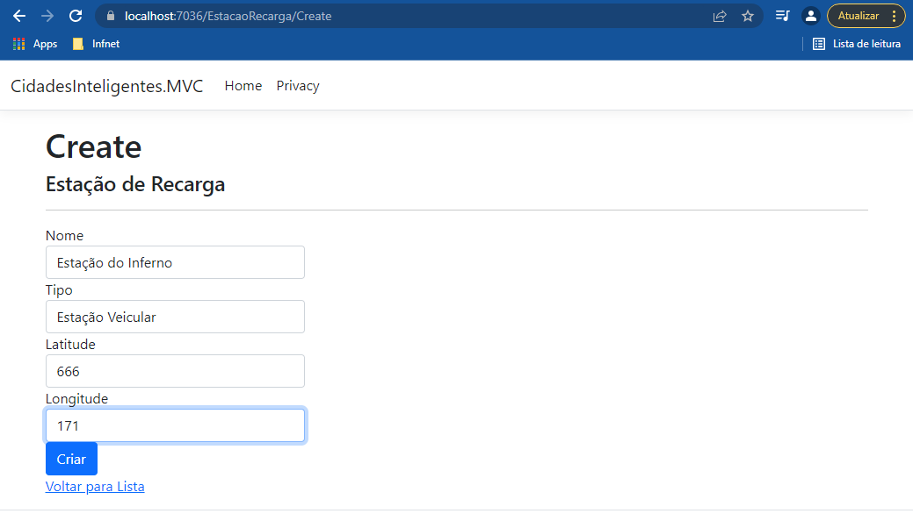
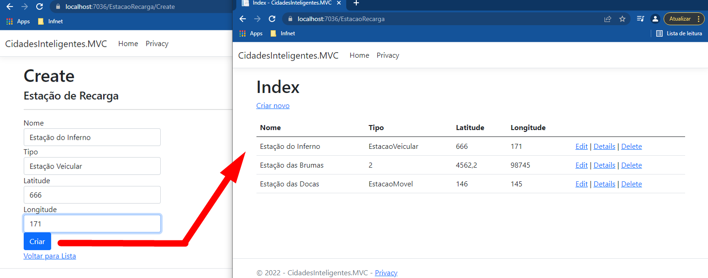
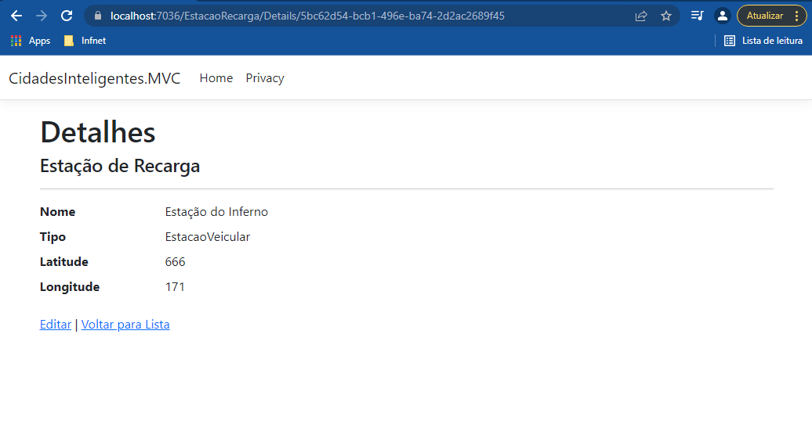
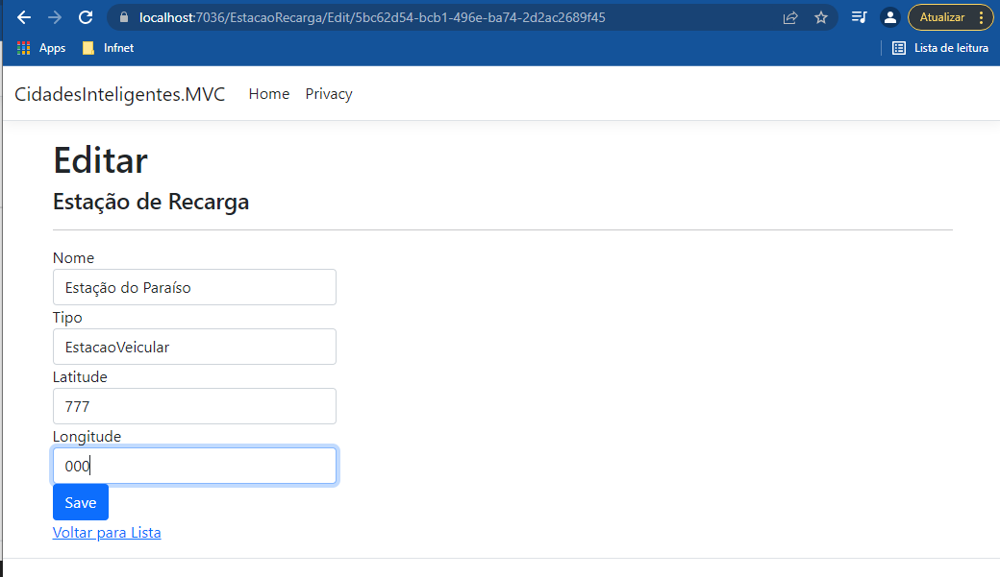
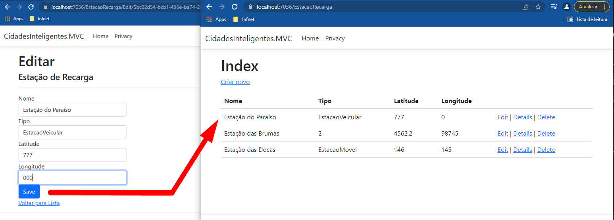
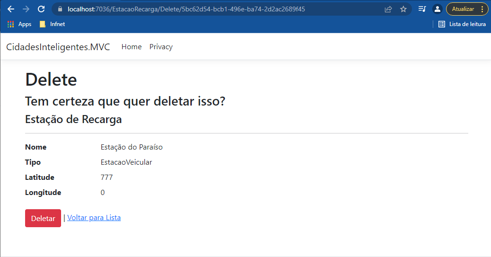
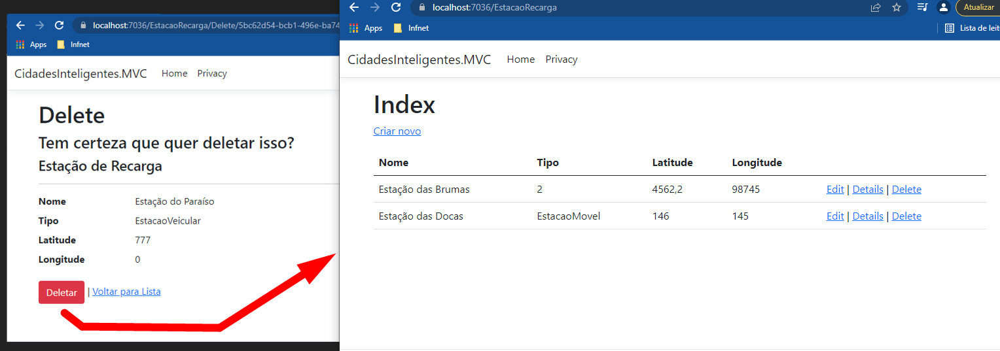
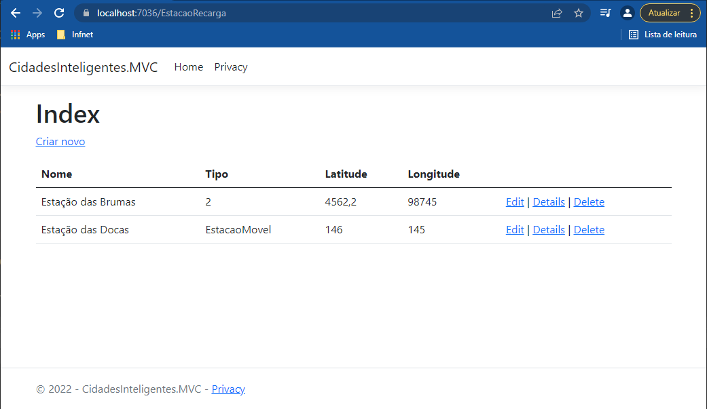

# CidadesInteligentes

Trabalho do Módulo de C# do curso de pós-graduação de Engenharia de Software (Infnet)
Projeto de CRUD EntityFrameworkCore em .NET6 usando DDD e MVC

## Requisitos funcionais da aplicação:
- No contexto de Cidades Inteligentes, no desenvolvimento de uma aplicação aglomeradora de informações ao cidadão local e ao turista, surge uma nova história de usuário:

Como cidadão ou turista, desejo verificar, no mapa, as estações de recarga de celular e veículos elétricos nas minhas proximidades.

- Com isso, foram elucidadas as seguintes tarefas:
  - A criação de uma classe EstacaoRecarga, que contém as seguintes propriedades:
    - Id, identificador da classe, em formato Guid.
    - Nome, identificador nominal da estação, em formato string.
    - Tipo, que determina o tipo de estação, que pode ser:
      - Estação veicular, para carga de veículos.
      - Estação móvel, para carga de bicicletas elétricas e dispositivos móveis.
    - Latitude, a latitude da estação, em formato double.*
      - Longitude, a longitude da estação, em formato double.*
        - *Pode-se ainda usar decimal. 
  - A criação de um back-end de CRUD com cadastro, edição, detalhamento, exclusão e listagem de EstacaoRecarga, utilizando DDD.
  - Mocks com IUs geradas, pelo próprio Visual Studio, para teste simples das funcionalidades de CRUD. Dados como latitude e longitude podem ser impressos em texto.

## Prints de tela

[Clique aqui para acessar print de tela:](https://github.com/marlonbraga/CidadesInteligentes/blob/main/docfiles/Criação.png)

[Clique aqui para acessar print de tela:](https://github.com/marlonbraga/CidadesInteligentes/blob/main/docfiles/Criação-2.png)

[Clique aqui para acessar print de tela:](https://github.com/marlonbraga/CidadesInteligentes/blob/main/docfiles/Detalhes.png)

[Clique aqui para acessar print de tela:](https://github.com/marlonbraga/CidadesInteligentes/blob/main/docfiles/Edição.png)

[Clique aqui para acessar print de tela:](https://github.com/marlonbraga/CidadesInteligentes/blob/main/docfiles/Edição-2.png)

[Clique aqui para acessar print de tela:](https://github.com/marlonbraga/CidadesInteligentes/blob/main/docfiles/Exclusão.png)

[Clique aqui para acessar print de tela:](https://github.com/marlonbraga/CidadesInteligentes/blob/main/docfiles/Exclusão-2.png)

[Clique aqui para acessar print de tela:](https://github.com/marlonbraga/CidadesInteligentes/blob/main/docfiles/Listagem.png)

## Instruções de entrega da avaliação:
- A entrega deve ser feita, impreterivelmente, pelo Moodle.
- Faça upload de todo o código do seu projeto em um sistema de versionamento, como Github, Gitlab ou similar, e envie, no Moodle, um documento contendo o link para o projeto, o relatório respondendo às questões pedidas e prints de tela do funcionamento de cada uma das funcionalidades solicitadas.
  - Lembre-se de que o repositório deve ser público ou compartilhado com o prof. em carlos.pivotto@infnet.edu.br

## Requisitos técnicos e arquiteturais:
- Deve-se utilizar .NET Core 3.1 ou superior.
- Deve-se utilizar Domain-Driven Design na construção da solução.
- Pacotes auxiliares podem ser usados à vontade.
- Não é necessário utilizar ASP.NET Identity
